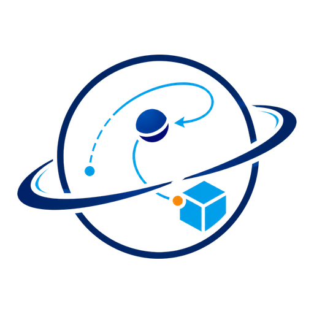
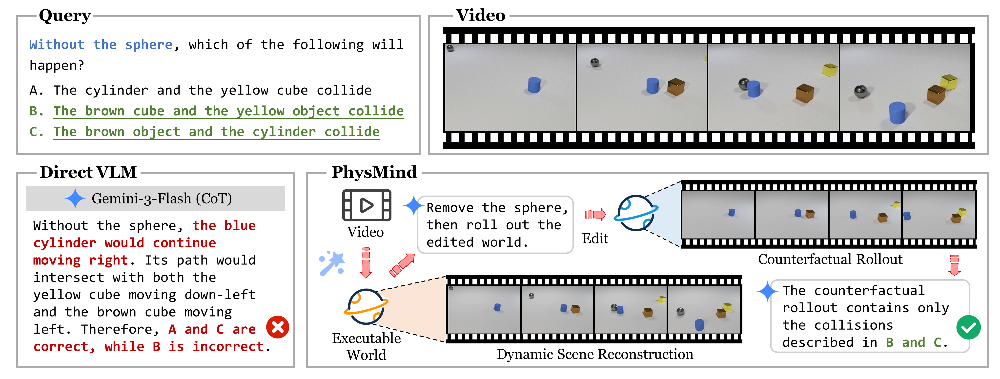

<div align="center">
  

  <h1>PhysMind: From Video to Executable Worlds<br>for Training-Free Physical Reasoning</h1>

  <p>
    Chen Yang<sup>1,*</sup> ·
    Shenxiang Zeng<sup>1,*</sup> ·
    Haoyang Zhao<sup>1</sup> · Zhouyuan Xu<sup>1</sup> · Youquan He<sup>1</sup> ·
    Haoyu Li<sup>1</sup> · Mingyi Deng<sup>2</sup> ·
    Jiansheng Fan<sup>1</sup> · Chen Wang<sup>1,†</sup>
  </p>

  <p>
    <sup>1</sup>Tsinghua University &nbsp;&nbsp; <sup>2</sup>The University of Hong Kong<br>
    <sup>*</sup>Equal contribution and core development &nbsp;&nbsp; <sup>†</sup>Corresponding author
  </p>

  <p>
    <a href="https://physmind.github.io/"></a>
    <a href="https://arxiv.org/pdf/2608.04575"></a>
    <a href="https://arxiv.org/abs/2608.04575"></a>
  </p>
</div>

## 🔥 News

- 🎉 **[2026-08-25]** Code and reproduction instructions released.
- 📄 **[2026-08-05]** PhysMind released on arXiv.

## Introduction

PhysMind turns an observed video into an executable 3D world, then answers physical-reasoning questions by reconstructing and rolling out that world. It is training-free: a vision-language model plans and interprets the scene, while geometry, tracking, system identification, and simulation tools provide explicit physical evidence.

<div align="center">
  
</div>

PhysMind supports two complementary benchmarks:

- **CLEVRER:** descriptive, explanatory, predictive, and counterfactual video reasoning over all 5,000 validation videos.
- **Physion++:** object-contact prediction over 384 trials from five rigid-body scenarios involving mass, friction, and bounciness.

| Benchmark | Metric | Gemini-3-Flash (CoT) | PhysMind |
| --- | --- | ---: | ---: |
| CLEVRER | Per-question accuracy | 34.32 | **72.55** |
| CLEVRER | Per-option accuracy | 64.97 | **87.22** |
| Physion++ | Accuracy | 51.56 | **59.64** |

With the same VLM backbone, PhysMind improves over direct chain-of-thought answering by **38.23 points** on CLEVRER and **8.08 points** on Physion++.

## Method

The unified pipeline follows six stages:

1. identify and segment relevant objects;
2. reconstruct metric 3D geometry;
3. track object poses through the video;
4. fit a simulatable world to visible evidence;
5. roll out question-conditioned futures or counterfactuals;
6. answer from the reconstructed artifacts.

Dataset- and scenario-specific choices are declared in [`configs/pipeline_route_policy.json`](configs/pipeline_route_policy.json), while the Python pipeline remains shared.

## Installation

Clone the repository and its tool submodules:

```bash
git clone --recursive https://github.com/ccyydd/PhysMind.git
cd PhysMind
```

For lightweight VLM direct answering:

```bash
conda create -n physmind -c conda-forge --override-channels python=3.12 pip -y
conda activate physmind
python -m pip install -r requirements-direct.txt
```

The executable-world pipeline additionally requires the geometry, tracking, reconstruction, and simulation tools. Follow the [full environment guide](docs/tool_env.md) for a standard Linux/Conda installation.

Configure the API provider you use:

```bash
cp .env.example .env
```

## Data Preparation

Only the benchmark inputs used by PhysMind are prepared.

### CLEVRER

Download and verify the official questions and all **5,000 validation videos**:

```bash
python scripts/prepare_clevrer.py --root data/clevrer
```

### Physion++

Download the official archive, retain the **384 supported rigid-body trials**, and generate the terminal red/yellow cue videos used for evaluation:

```bash
python scripts/prepare_physion_pp.py --root data/physion_pp
```

The 384 trials cover Mass Collision (64), Friction Collision (64), Friction Platform (64), Bouncy Platform (96), and Bouncy Wall (96). The full downloaded archive is removed after successful selective extraction unless `--keep-archive` is specified.

Use `--check-only` with either preparation script to validate an existing dataset without downloading or modifying it.

## Quick Start

Run the complete executable-world pipeline:

```bash
# CLEVRER
python physmind.py \
  --bench clevrer \
  --mode world-model-agent \
  --dataset-root data/clevrer

# Physion++
python physmind.py \
  --bench physion_pp \
  --mode world-model-agent \
  --dataset-root data/physion_pp
```

Run the VLM direct-answer baseline by replacing `--mode world-model-agent` with `--mode direct-answer`. Use `--provider`, `--model`, `--scene-ids`, and `--limit` to select a backend or a smaller evaluation subset:

```bash
python physmind.py \
  --bench clevrer \
  --mode direct-answer \
  --dataset-root data/clevrer \
  --provider openrouter \
  --model google/gemini-3-flash-preview \
  --limit 10
```

Run outputs are written under `runs/`. Use `python physmind.py --help` for all supported options.

## Debug Visualization

Normal evaluation does not require debug rendering. To retain intermediate diagnostics and render a single scene for inspection, add `--debug-artifacts`:

```bash
python physmind.py \
  --bench clevrer \
  --mode world-model-agent \
  --dataset-root data/clevrer \
  --scene-ids 10000 \
  --debug-artifacts
```

Depending on the completed stages, the run directory contains visualizations of segmentation, depth, reconstructed meshes, object poses, visible-evidence fitting, and question-conditioned rollouts. The maintained [refined Blender renderer](scripts/world_model/render_world_reconstruction_refined_debug.py) produces the camera-view debug video; top-down rendering is not part of the current public pipeline.

Debug rendering is intended to inspect reconstructed geometry, poses, trajectories, contacts, and physical rollouts—not to reproduce photorealistic appearance. Blender lighting, materials, backgrounds, and rendering styles may be adjusted freely: these appearance choices are not the primary focus of PhysMind and do not participate in benchmark evaluation. When comparing pipeline behavior, keep the reconstructed geometry, poses, camera projection, and simulated trajectories unchanged.

## Citation

If you find PhysMind useful, please cite:

```bibtex
@misc{yang2026physmindvideoexecutableworlds,
  title         = {PhysMind: From Video to Executable Worlds for Training-Free Physical Reasoning},
  author        = {Chen Yang and Shenxiang Zeng and Haoyang Zhao and Zhouyuan Xu and Youquan He and Haoyu Li and Mingyi Deng and Jiansheng Fan and Chen Wang},
  year          = {2026},
  eprint        = {2608.04575},
  archivePrefix = {arXiv},
  primaryClass  = {cs.CV},
  url           = {https://arxiv.org/abs/2608.04575}
}
```

## Acknowledgements

PhysMind builds on open-source research tools including Grounding DINO, SAM 3, SAM 3D, MoGe-2, Video Depth Anything, GeoCalib, FoundationPose, and Blender. We thank their authors and the CLEVRER and Physion++ teams.
